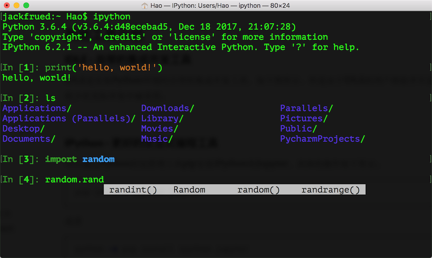

## 第一课 初识Python

### Python简介

#### Python的历史

1. 1989年圣诞节：Guido von Rossum开始写Python语言的编译器。
2. 1991年2月：第一个Python编译器（同时也是解释器）诞生，它是用C语言实现的（后面），可以调用C语言的库函数。在最早的版本中，Python已经提供了对“类”，“函数”，“异常处理”等构造块的支持，还有对列表、字典等核心数据类型，同时支持以模块为基础来构造应用程序。
3. 1994年1月：Python 1.0正式发布。
4. 2000年10月16日：Python 2.0发布，增加了完整的[垃圾回收](https://zh.wikipedia.org/wiki/%E5%9E%83%E5%9C%BE%E5%9B%9E%E6%94%B6_(%E8%A8%88%E7%AE%97%E6%A9%9F%E7%A7%91%E5%AD%B8))，提供了对[Unicode](https://zh.wikipedia.org/wiki/Unicode)的支持。与此同时，Python的整个开发过程更加透明，社区对开发进度的影响逐渐扩大，生态圈开始慢慢形成。
5. 2008年12月3日：Python 3.0发布，它并不完全兼容之前的Python代码，不过因为目前还有不少公司在项目和运维中使用Python 2.x版本，所以Python 3.x的很多新特性后来也被移植到Python 2.6/2.7版本中。

目前我使用的Python 3.7.x的版本是在2018年发布的，Python的版本号分为三段，形如A.B.C。其中A表示大版本号，一般当整体重写，或出现不向后兼容的改变时，增加A；B表示功能更新，出现新功能时增加B；C表示小的改动（例如：修复了某个Bug），只要有修改就增加C。如果对Python的历史感兴趣，可以阅读名为[《Python简史》](http://www.cnblogs.com/vamei/archive/2013/02/06/2892628.html)的网络文章。

#### Python的优缺点

Python的优点很多，简单的可以总结为以下几点。

1. 简单明了，学习曲线低，比很多编程语言都容易上手。
2. 开放源代码，拥有强大的社区和生态圈，尤其是在数据分析和机器学习领域。
3. 解释型语言，天生具有平台可移植性，代码可以工作于不同的操作系统。
4. 对两种主流的编程范式（面向对象编程和函数式编程）都提供了支持。
5. 代码规范程度高，可读性强，适合有代码洁癖和强迫症的人群。

Python的缺点主要集中在以下几点。

1. 执行效率稍低，对执行效率要求高的部分可以由其他语言（如：C、C++）编写。
2. 代码无法加密，但是现在很多公司都不销售卖软件而是销售服务，这个问题会被弱化。
3. 在开发时可以选择的框架太多（如Web框架就有100多个），有选择的地方就有错误。

#### Python的应用领域

目前Python在Web应用后端开发、云基础设施建设、DevOps、网络数据采集（爬虫）、自动化测试、数据分析、机器学习等领域都有着广泛的应用。

### 安装Python解释器

想要开始Python编程之旅，首先得在自己使用的计算机上安装Python解释器环境，下面将以安装官方的Python解释器为例，讲解如何在不同的操作系统上安装Python环境。官方的Python解释器是用C语言实现的，也是使用最为广泛的Python解释器，通常称之为CPython。除此之外，Python解释器还有Java语言实现的Jython、C#语言实现的IronPython以及PyPy、Brython、Pyston等版本，有兴趣的读者可以自行了解。

#### Windows环境

可以在[Python官方网站](https://www.python.org)下载到Python的Windows安装程序（exe文件），需要注意的是如果在Windows 7环境下安装Python 3.x，需要先安装Service Pack 1补丁包（可以通过一些工具软件自动安装系统补丁的功能来安装），安装过程建议勾选“Add Python 3.x to PATH”（将Python 3.x添加到PATH环境变量）并选择自定义安装，在设置“Optional Features”界面最好将“pip”、“tcl/tk”、“Python test suite”等项全部勾选上。强烈建议选择自定义的安装路径并保证路径中没有中文。安装完成会看到“Setup was successful”的提示。如果稍后运行Python程序时，出现因为缺失一些动态链接库文件而导致Python解释器无法工作的问题，可以按照下面的方法加以解决。

如果系统显示api-ms-win-crt\*.dll文件缺失，可以参照[《api-ms-win-crt\*.dll缺失原因分析和解决方法》](<https://zhuanlan.zhihu.com/p/32087135>)一文讲解的方法进行处理或者直接在[微软官网](https://www.microsoft.com/zh-cn/download/details.aspx?id=48145)下载Visual C++ Redistributable for Visual Studio 2015文件进行修复；如果是因为更新Windows的DirectX之后导致某些动态链接库文件缺失问题，可以下载一个[DirectX修复工具](<https://dl.pconline.com.cn/download/360074-1.html>)进行修复。

#### Linux环境

Linux环境自带了Python 2.x版本，但是如果要更新到3.x的版本，可以在[Python的官方网站](https://www.python.org)下载Python的源代码并通过源代码构建安装的方式进行安装，具体的步骤如下所示（以CentOS为例）。

1. 安装依赖库（因为没有这些依赖库可能在源代码构件安装时因为缺失底层依赖库而失败）。

```Shell
yum -y install wget gcc zlib-devel bzip2-devel openssl-devel ncurses-devel sqlite-devel readline-devel tk-devel gdbm-devel db4-devel libpcap-devel xz-devel libffi-devel
```

2. 下载Python源代码并解压缩到指定目录。

```Shell
wget https://www.python.org/ftp/python/3.7.6/Python-3.7.6.tar.xz
xz -d Python-3.7.6.tar.xz
tar -xvf Python-3.7.6.tar
```

3. 切换至Python源代码目录并执行下面的命令进行配置和安装。

```Shell
cd Python-3.7.6
./configure --prefix=/usr/local/python37 --enable-optimizations
make && make install
```

4. 修改用户主目录下名为.bash_profile的文件，配置PATH环境变量并使其生效。

```Shell
cd ~
vim .bash_profile
```

```Shell
# ... 此处省略上面的代码 ...

export PATH=$PATH:/usr/local/python37/bin

# ... 此处省略下面的代码 ...
```

5. 激活环境变量。

```Shell
source .bash_profile
```

#### macOS环境

macOS也自带了Python 2.x版本，可以通过[Python的官方网站](https://www.python.org)提供的安装文件（pkg文件）安装Python 3.x的版本。默认安装完成后，可以通过在终端执行`python`命令来启动2.x版本的Python解释器，启动3.x版本的Python解释器需要执行`python3`命令。

### 运行Python程序

#### 确认Python的版本

可以Windows的命令行提示符中键入下面的命令。

```Shell
python --version
```
在Linux或macOS系统的终端中键入下面的命令。

```Shell
python3 --version
```

当然也可以先输入`python`或`python3`进入交互式环境，再执行以下的代码检查Python的版本。

```Python
import sys

print(sys.version_info)
print(sys.version)
```

#### 编写Python源代码

可以用文本编辑工具（推荐使用[Sublime](<https://www.sublimetext.com/>)、[Visual Studio Code](<https://code.visualstudio.com/>)等高级文本编辑工具）编写Python源代码并用py作为后缀名保存该文件，代码内容如下所示。

```Python
print('hello, world!')
```

#### 运行程序

切换到源代码所在的目录并执行下面的命令，看看屏幕上是否输出了"hello, world!"。

```Shell
python hello.py
```

或

```Shell
python3 hello.py
```

#### 代码中的注释

注释是编程语言的一个重要组成部分，用于在源代码中解释代码的作用从而增强程序的可读性和可维护性，当然也可以将源代码中不需要参与运行的代码段通过注释来去掉，这一点在调试程序的时候经常用到。注释在随源代码进入预处理器或编译时会被移除，不会在目标代码中保留也不会影响程序的执行结果。

1. 单行注释 - 以#和空格开头的部分
2. 多行注释 - 三个引号开头，三个引号结尾

```Python
"""
第一个Python程序 - hello, world!
向伟大的Dennis M. Ritchie先生致敬

Version: 0.1
Author: lazycat
"""
print('hello, world!')
# print("你好, 世界！")
```

### Python开发工具

#### IDLE - 自带的集成开发工具

IDLE是安装Python环境时自带的集成开发工具，如下图所示。但是由于IDLE的用户体验并不是那么好所以很少在实际开发中被采用。


#### IPython - 更好的交互式编程工具

IPython是一种基于Python的交互式解释器。相较于原生的Python交互式环境，IPython提供了更为强大的编辑和交互功能。可以通过Python的包管理工具pip安装IPython，具体的操作如下所示。

```Shell
pip install ipython
```

或

```Shell
pip3 install ipython
```

安装成功后，可以通过下面的ipython命令启动IPython，如下图所示。



#### Sublime Text - 高级文本编辑器


- 首先可以通过[官方网站](https://www.sublimetext.com/)下载安装程序安装Sublime Text 3或Sublime Text 2。

- 安装包管理工具。
  1. 通过快捷键Ctrl+`或者在View菜单中选择Show Console打开控制台，输入下面的代码。

  - Sublime 3

  ```Python
  import  urllib.request,os;pf='Package Control.sublime-package';ipp=sublime.installed_packages_path();urllib.request.install_opener(urllib.request.build_opener(urllib.request.ProxyHandler()));open(os.path.join(ipp,pf),'wb').write(urllib.request.urlopen('http://sublime.wbond.net/'+pf.replace(' ','%20')).read())
  ```
  - Sublime 2

  ```Python
  import  urllib2,os;pf='Package Control.sublime-package';ipp=sublime.installed_packages_path();os.makedirs(ipp)ifnotos.path.exists(ipp)elseNone;urllib2.install_opener(urllib2.build_opener(urllib2.ProxyHandler()));open(os.path.join(ipp,pf),'wb').write(urllib2.urlopen('http://sublime.wbond.net/'+pf.replace(' ','%20')).read());print('Please restart Sublime Text to finish installation')
  ```
  2. 在浏览器中输入  https://sublime.wbond.net/Package%20Control.sublime-package 下载包管理工具的安装包，并找到安装Sublime目录下名为&quot;Installed Packages&quot;的目录，把刚才下载的文件放到这个文件加下，然后重启Sublime Text就搞定了。


- 安装插件。通过Preference菜单的Package Control或快捷键Ctrl+Shift+P打开命令面板，在面板中输入Install Package就可以找到安装插件的工具，然后再查找需要的插件。我们推荐大家安装以下几个插件：

  - SublimeCodeIntel - 代码自动补全工具插件。
  - Emmet - 前端开发代码模板插件。
  - Git - 版本控制工具插件。
  - Python PEP8 Autoformat - PEP8规范自动格式化插件。
  - ConvertToUTF8 - 将本地编码转换为UTF-8。

> **说明**：事实上[Visual Studio Code](<https://code.visualstudio.com/>)可能是更好的选择，它不用花钱并提供了更为完整和强大的功能，有兴趣的读者可以自行研究。

#### PyCharm - Python开发神器

PyCharm的安装、配置和使用在[《玩转PyCharm》](../番外篇/玩转PyCharm.md)进行了介绍，有兴趣的读者可以选择阅读。


### 练习

1. 在Python交互式环境中输入下面的代码并查看结果，请尝试将看到的内容翻译成中文。

    ```Python
    import this
    ```

    > **说明**：输入上面的代码，在Python的交互式环境中可以看到Tim Peter撰写的[“Python之禅”](../Python之禅.md)，里面讲述的道理不仅仅适用于Python，也适用于其他编程语言。

2. 学习使用turtle在屏幕上绘制图形。

    > **说明**：turtle是Python内置的一个非常有趣的模块，特别适合对计算机程序设计进行初体验的小伙伴，它最早是Logo语言的一部分，Logo语言是Wally Feurzig和Seymour Papert在1966发明的编程语言。

    ```Python
    import turtle
    
    turtle.pensize(4)
    turtle.pencolor('red')
    
    turtle.forward(100)
    turtle.right(90)
    turtle.forward(100)
    turtle.right(90)
    turtle.forward(100)
    turtle.right(90)
    turtle.forward(100)
    
    turtle.mainloop()
    ```

    > **提示**：本章提供的代码中还有画国旗和画小猪佩奇的代码，有兴趣的读者请自行研究。

## 第二课 语言元素

#### 指令和程序

计算机的硬件系统通常由五大部件构成，包括：运算器、控制器、存储器、输入设备和输出设备。其中，运算器和控制器放在一起就是我们通常所说的中央处理器，它的功能是执行各种运算和控制指令以及处理计算机软件中的数据。我们通常所说的程序实际上就是指令的集合，我们程序就是将一系列的指令按照某种方式组织到一起，然后通过这些指令去控制计算机做我们想让它做的事情。今天我们大多数时候使用的计算机，虽然它们的元器件做工越来越精密，处理能力越来越强大，但究其本质来说仍然属于[“冯·诺依曼结构”](https://zh.wikipedia.org/wiki/%E5%86%AF%C2%B7%E8%AF%BA%E4%BC%8A%E6%9B%BC%E7%BB%93%E6%9E%84)的计算机。“冯·诺依曼结构”有两个关键点，一是指出要将存储设备与中央处理器分开，二是提出了将数据以二进制方式编码。二进制是一种“逢二进一”的计数法，跟我们人类使用的“逢十进一”的计数法没有实质性的区别，人类因为有十根手指所以使用了十进制（因为在数数时十根手指用完之后就只能进位了，当然凡事都有例外，玛雅人可能是因为长年光着脚的原因把脚趾头也算上了，于是他们使用了二十进制的计数法，在这种计数法的指导下玛雅人的历法就与我们平常使用的历法不一样，而按照玛雅人的历法，2012年是上一个所谓的“太阳纪”的最后一年，而2013年则是新的“太阳纪”的开始，后来这件事情被以讹传讹的方式误传为”2012年是玛雅人预言的世界末日“这种荒诞的说法，今天我们可以大胆的猜测，玛雅文明之所以发展缓慢估计也与使用了二十进制有关）。对于计算机来说，二进制在物理器件上来说是最容易实现的（高电压表示1，低电压表示0），于是在“冯·诺依曼结构”的计算机都使用了二进制。虽然我们并不需要每个程序员都能够使用二进制的思维方式来工作，但是了解二进制以及它与我们生活中的十进制之间的转换关系，以及二进制与八进制和十六进制的转换关系还是有必要的。如果你对这一点不熟悉，可以自行使用[维基百科](https://zh.wikipedia.org/wiki/%E4%BA%8C%E8%BF%9B%E5%88%B6)或者[百度百科](https://baike.baidu.com)科普一下。

> **说明**：近期关于**量子计算机**的研究已经被推倒了风口浪尖，量子计算机基于量子力学进行运算，使用量子瞬移的方式来传递信息。2018年6月，Intel宣布开发出新款量子芯片并通过了在接近绝对零度环境下的测试；2019年，IBM和Google都推出了自己的量子计算机。

### 变量和类型

在程序设计中，变量是一种存储数据的载体。计算机中的变量是实际存在的数据或者说是存储器中存储数据的一块内存空间，变量的值可以被读取和修改，这是所有计算和控制的基础。计算机能处理的数据有很多种类型，除了数值之外还可以处理文本、图形、音频、视频等各种各样的数据，那么不同的数据就需要定义不同的存储类型。Python中的数据类型很多，而且也允许我们自定义新的数据类型（这一点在后面会讲到），我们先介绍几种常用的数据类型。

- 整型：Python中可以处理任意大小的整数（Python 2.x中有`int`和`long`两种类型的整数，但这种区分对Python来说意义不大，因此在Python 3.x中整数只有int这一种了），而且支持二进制（如`0b100`，换算成十进制是4）、八进制（如`0o100`，换算成十进制是64）、十进制（`100`）和十六进制（`0x100`，换算成十进制是256）的表示法。
- 浮点型：浮点数也就是小数，之所以称为浮点数，是因为按照科学记数法表示时，一个浮点数的小数点位置是可变的，浮点数除了数学写法（如`123.456`）之外还支持科学计数法（如`1.23456e2`）。
- 字符串型：字符串是以单引号或双引号括起来的任意文本，比如`'hello'`和`"hello"`,字符串还有原始字符串表示法、字节字符串表示法、Unicode字符串表示法，而且可以书写成多行的形式（用三个单引号或三个双引号开头，三个单引号或三个双引号结尾）。
- 布尔型：布尔值只有`True`、`False`两种值，要么是`True`，要么是`False`，在Python中，可以直接用`True`、`False`表示布尔值（请注意大小写），也可以通过布尔运算计算出来（例如`3 < 5`会产生布尔值`True`，而`2 == 1`会产生布尔值`False`）。
- 复数型：形如`3+5j`，跟数学上的复数表示一样，唯一不同的是虚部的`i`换成了`j`。实际上，这个类型并不常用，大家了解一下就可以了。

#### 变量命名

对于每个变量我们需要给它取一个名字，就如同我们每个人都有属于自己的响亮的名字一样。在Python中，变量命名需要遵循以下这些必须遵守硬性规则和强烈建议遵守的非硬性规则。

- 硬性规则：
  - 变量名由字母（广义的Unicode字符，不包括特殊字符）、数字和下划线构成，数字不能开头。
  - 大小写敏感（大写的`a`和小写的`A`是两个不同的变量）。
  - 不要跟关键字（有特殊含义的单词，后面会讲到）和系统保留字（如函数、模块等的名字）冲突。
- PEP 8要求：
  - 用小写字母拼写，多个单词用下划线连接。
  - 受保护的实例属性用单个下划线开头（后面会讲到）。
  - 私有的实例属性用两个下划线开头（后面会讲到）。

当然，作为一个专业的程序员，给变量（事实上应该是所有的标识符）命名时做到见名知意也是非常重要的。

#### 变量的使用

下面通过几个例子来说明变量的类型和变量使用。

```Python
"""
使用变量保存数据并进行加减乘除运算

Version: 0.1
Author: lazycat
"""
a = 321
b = 12
print(a + b)    # 333
print(a - b)    # 309
print(a * b)    # 3852
print(a / b)    # 26.75
```

在Python中可以使用`type`函数对变量的类型进行检查。程序设计中函数的概念跟数学上函数的概念是一致的，数学上的函数相信大家并不陌生，它包括了函数名、自变量和因变量。如果暂时不理解这个概念也不要紧，我们会在后续的章节中专门讲解函数的定义和使用。

```Python
"""
使用type()检查变量的类型

Version: 0.1
Author: lazycat
"""
a = 100
b = 12.345
c = 1 + 5j
d = 'hello, world'
e = True
print(type(a))    # <class 'int'>
print(type(b))    # <class 'float'>
print(type(c))    # <class 'complex'>
print(type(d))    # <class 'str'>
print(type(e))    # <class 'bool'>
```

可以使用Python中内置的函数对变量类型进行转换。

- `int()`：将一个数值或字符串转换成整数，可以指定进制。
- `float()`：将一个字符串转换成浮点数。
- `str()`：将指定的对象转换成字符串形式，可以指定编码。
- `chr()`：将整数转换成该编码对应的字符串（一个字符）。
- `ord()`：将字符串（一个字符）转换成对应的编码（整数）。

下面的代码通过键盘输入两个整数来实现对两个整数的算术运算。

```Python
"""
使用input()函数获取键盘输入(字符串)
使用int()函数将输入的字符串转换成整数
使用print()函数输出带占位符的字符串

Version: 0.1
Author: lazycat
"""
a = int(input('a = '))
b = int(input('b = '))
print('%d + %d = %d' % (a, b, a + b))
print('%d - %d = %d' % (a, b, a - b))
print('%d * %d = %d' % (a, b, a * b))
print('%d / %d = %f' % (a, b, a / b))
print('%d // %d = %d' % (a, b, a // b))
print('%d %% %d = %d' % (a, b, a % b))
print('%d ** %d = %d' % (a, b, a ** b))
```

> **说明**：上面的print函数中输出的字符串使用了占位符语法，其中`%d`是整数的占位符，`%f`是小数的占位符，`%%`表示百分号（因为百分号代表了占位符，所以带占位符的字符串中要表示百分号必须写成`%%`），字符串之后的`%`后面跟的变量值会替换掉占位符然后输出到终端中，运行上面的程序，看看程序执行结果就明白啦。

### 运算符

Python支持多种运算符，下表大致按照优先级从高到低的顺序列出了所有的运算符，运算符的优先级指的是多个运算符同时出现时，先做什么运算然后再做什么运算。除了我们之前已经用过的赋值运算符和算术运算符，我们稍后会陆续讲到其他运算符的使用。

| 运算符                                                       | 描述                           |
| ------------------------------------------------------------ | ------------------------------ |
| `[]` `[:]`                                                   | 下标，切片                     |
| `**`                                                         | 指数                           |
| `~` `+` `-`                                                  | 按位取反, 正负号               |
| `*` `/` `%` `//`                                             | 乘，除，模，整除               |
| `+` `-`                                                      | 加，减                         |
| `>>` `<<`                                                    | 右移，左移                     |
| `&`                                                          | 按位与                         |
| `^` `\|`                                                     | 按位异或，按位或               |
| `<=` `<` `>` `>=`                                            | 小于等于，小于，大于，大于等于 |
| `==` `!=`                                                    | 等于，不等于                   |
| `is`  `is not`                                               | 身份运算符                     |
| `in` `not in`                                                | 成员运算符                     |
| `not` `or` `and`                                             | 逻辑运算符                     |
| `=` `+=` `-=` `*=` `/=` `%=` `//=` `**=` `&=` `|=` `^=` `>>=` `<<=` | （复合）赋值运算符             |

>**说明：** 在实际开发中，如果搞不清楚运算符的优先级，可以使用括号来确保运算的执行顺序。

#### 赋值运算符

赋值运算符应该是最为常见的运算符，它的作用是将右边的值赋给左边的变量。下面的例子演示了赋值运算符和复合赋值运算符的使用。

```Python
"""
赋值运算符和复合赋值运算符

Version: 0.1
Author: lazycat
"""
a = 10
b = 3
a += b        # 相当于：a = a + b
a *= a + 2    # 相当于：a = a * (a + 2)
print(a)      # 算一下这里会输出什么
```

### 比较运算符和逻辑运算符

比较运算符有的地方也称为关系运算符，包括`==`、`!=`、`<`、`>`、`<=`、`>=`，我相信没有什么好解释的，大家一看就能懂，唯一需要提醒的是比较相等用的是`==`，请注意这个地方是两个等号，因为`=`是赋值运算符，我们在上面刚刚讲到过，`==`才是比较相等的比较运算符。比较运算符会产生布尔值，要么是`True`要么是`False`。

逻辑运算符有三个，分别是`and`、`or`和`not`。`and`字面意思是“而且”，所以`and`运算符会连接两个布尔值，如果两个布尔值都是`True`，那么运算的结果就是`True`；左右两边的布尔值有一个是`False`，最终的运算结果就是`False`。相信大家已经想到了，如果`and`左边的布尔值是`False`，不管右边的布尔值是什么，最终的结果都是`False`，所以在做运算的时候右边的值会被跳过（短路处理），这也就意味着在`and`运算符左边为`False`的情况下，右边的表达式根本不会执行。`or`字面意思是“或者”，所以`or`运算符也会连接两个布尔值，如果两个布尔值有任意一个是`True`，那么最终的结果就是`True`。当然，`or`运算符也是有短路功能的，在它左边的布尔值为`True`的情况下，右边的表达式根本不会执行。`not`运算符的后面会跟上一个布尔值，它的作用是得到与该布尔值相反的值，也就是说，后面的布尔值如果是`True`运算结果就是`False`，而后面的布尔值如果是`False`则运算结果就是`True`。

```Python
"""
比较运算符和逻辑运算符的使用

Version: 0.1
Author: lazycat
"""
flag0 = 1 == 1
flag1 = 3 > 2
flag2 = 2 < 1
flag3 = flag1 and flag2
flag4 = flag1 or flag2
flag5 = not (1 != 2)
print('flag0 =', flag0)    # flag0 = True
print('flag1 =', flag1)    # flag1 = True
print('flag2 =', flag2)    # flag2 = False
print('flag3 =', flag3)    # flag3 = False
print('flag4 =', flag4)    # flag4 = True
print('flag5 =', flag5)    # flag5 = False
```

> **说明**：比较运算符的优先级高于赋值运算符，所以`flag0 = 1 == 1`先做`1 == 1`产生布尔值`True`，再将这个值赋值给变量`flag0`。`print`函数可以输出多个值，多个值之间可以用`,`进行分隔，输出的内容之间默认以空格分开。

### 练习

#### 练习1：华氏温度转换为摄氏温度。

> 提示：华氏温度到摄氏温度的转换公式为：$C=(F - 32) \div 1.8$。

参考答案：

```Python
"""
将华氏温度转换为摄氏温度

Version: 0.1
Author: lazycat
"""
f = float(input('请输入华氏温度: '))
c = (f - 32) / 1.8
print('%.1f华氏度 = %.1f摄氏度' % (f, c))
```

> **说明**：在使用`print`函数输出时，也可以对字符串内容进行格式化处理，上面`print`函数中的字符串`%.1f`是一个占位符，稍后会由一个`float`类型的变量值替换掉它。同理，如果字符串中有`%d`，后面可以用一个`int`类型的变量值替换掉它，而`%s`会被字符串的值替换掉。除了这种格式化字符串的方式外，还可以用下面的方式来格式化字符串，其中`{f:.1f}`和`{c:.1f}`可以先看成是`{f}`和`{c}`，表示输出时会用变量`f`和变量`c`的值替换掉这两个占位符，后面的`:.1f`表示这是一个浮点数，小数点后保留1位有效数字。
>
> ```Python
> print(f'{f:.1f}华氏度 = {c:.1f}摄氏度')
> ```

#### 练习2：输入圆的半径计算计算周长和面积。

参考答案：

```Python
"""
输入半径计算圆的周长和面积

Version: 0.1
Author: lazycat
"""
radius = float(input('请输入圆的半径: '))
perimeter = 2 * 3.1416 * radius
area = 3.1416 * radius * radius
print('周长: %.2f' % perimeter)
print('面积: %.2f' % area)
```

#### 练习3：输入年份判断是不是闰年。

参考答案：

```Python
"""
输入年份 如果是闰年输出True 否则输出False

Version: 0.1
Author: lazycat
"""
year = int(input('请输入年份: '))
# 如果代码太长写成一行不便于阅读 可以使用\对代码进行折行
is_leap = year % 4 == 0 and year % 100 != 0 or \
          year % 400 == 0
print(is_leap)
```

> **说明**：比较运算符会产生布尔值，而逻辑运算符`and`和`or`会对这些布尔值进行组合，最终也是得到一个布尔值，闰年输出`True`，平年输出`False`。
